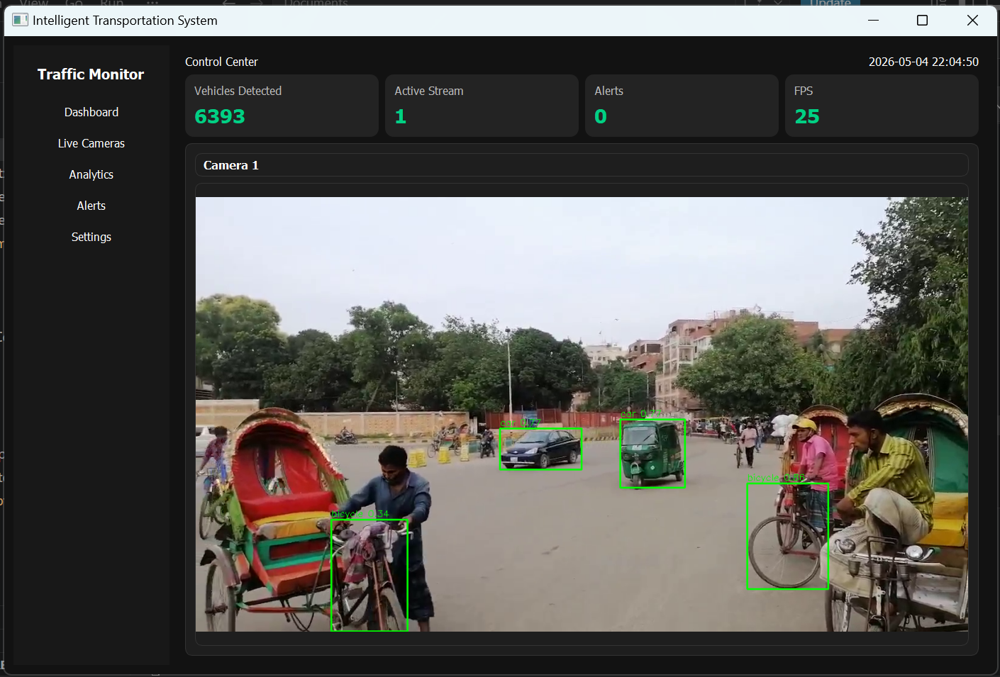
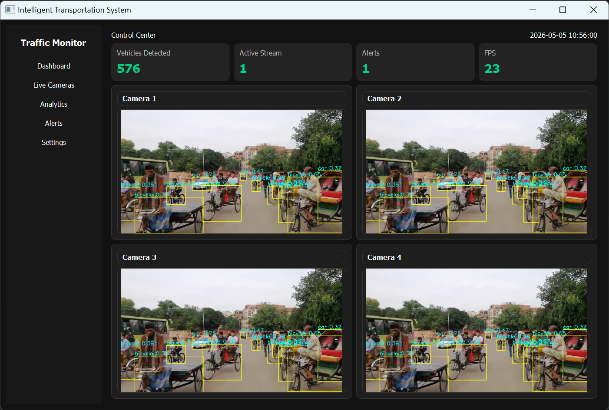
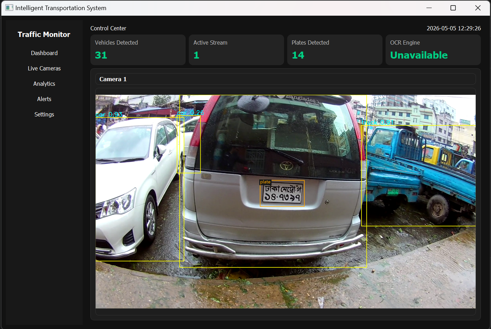

# Intelligent Transportation System

A desktop traffic-monitoring application built with Python, PyQt5, OpenCV, Ultralytics YOLO, and optional OCR support. The app plays a video stream, detects vehicles, detects license plates, shows a live dashboard, saves cropped vehicle and plate images, and logs saved captures into SQLite.





## Features

- Live video monitoring with a PyQt5 desktop interface
- Vehicle detection using YOLO
- License plate detection using a second YOLO model
- Optional OCR support for reading Bangla and English license plate text
- Vehicle counting for common road vehicles:
  - `car`
  - `bus`
  - `truck`
  - `motorcycle`
  - `bicycle`
- Vehicle image crop saving without bounding boxes in the saved file
- Automatic folder creation by date and vehicle type
- Automatic SQLite logging for each saved image

## Project Structure

```text
ITS/
|-- main.py
|-- traffic_config.py
|-- traffic_main_window.py
|-- traffic_ui.py
|-- traffic_detector.py
|-- traffic_capture.py
|-- traffic_database.py
|-- traffic_ocr.py
|-- requirements.txt
|-- README.md
|-- .venv/
```

## Requirements

- Windows
- Python 3.10+
- A valid vehicle YOLO model file
- A valid license plate YOLO model file
- A source video file
- Tesseract OCR with Bengali and English language data for Bangla plate reading

## Default Paths

These paths are configured in [traffic_config.py](/C:/Users/HP/Documents/ITS/traffic_config.py):

- Video file: `d:\its-info\lpr-vehicle.mp4`
- YOLO model: `d:\its-info\yolov8n.pt`
- License plate model: `d:\its-info\license_plate_detector.pt`
- Tesseract executable: `C:\Program Files\Tesseract-OCR\tesseract.exe`
- Capture folder: `d:\its-info\capture_vehicles`
- Database file: `d:\its-info\transport.db`

Update those paths if your files are stored somewhere else.

## Setup

### 1. Create and activate a virtual environment

```powershell
python -m venv .venv
.\.venv\Scripts\activate
```

### 2. Install dependencies

Install the general packages:

```powershell
python -m pip install -r requirements.txt
```

If PyTorch needs a CPU-only install, use:

```powershell
python -m pip install torch==2.5.1+cpu torchvision==0.20.1+cpu torchaudio==2.5.1+cpu --index-url https://download.pytorch.org/whl/cpu
```

### 3. Make sure the input files exist

Place these files in the configured locations:

- `d:\its-info\lpr-vehicle.mp4`
- `d:\its-info\yolov8n.pt`
- `d:\its-info\license_plate_detector.pt`

### 4. Install OCR for Bangla license plate reading

Recommended OCR engine:

- Tesseract OCR for Windows
- Bengali language data: `ben`
- English language data: `eng`
- Python wrapper: `pytesseract`

Install the Python wrapper:

```powershell
.\.venv\Scripts\python -m pip install pytesseract
```

Install Tesseract OCR on Windows, then make sure these exist:

- `C:\Program Files\Tesseract-OCR\tesseract.exe`
- `C:\Program Files\Tesseract-OCR\tessdata\ben.traineddata`
- `C:\Program Files\Tesseract-OCR\tessdata\eng.traineddata`

## Run

Start the application with:

```powershell
.\.venv\Scripts\python main.py
```

## Capture Output

Saved vehicle images follow this structure:

```text
d:\its-info\capture_vehicles\dd-mm-yyyy\vehicle_type\hh-mm-ss-fff.png
```

Example:

```text
d:\its-info\capture_vehicles\04-05-2026\car\23-01-15-123.png
```

Notes:

- The saved image is the cropped vehicle only
- The saved image does not include the drawn bounding box
- If a plate is detected, the plate crop is also saved in a `plates` subfolder
- Folders are created automatically if they do not exist

Example plate output:

```text
d:\its-info\capture_vehicles\04-05-2026\car\plates\23-01-15-123.png
```

Example OCR text output:

```text
d:\its-info\capture_vehicles\04-05-2026\car\plates\23-01-15-123.txt
```

The `.txt` file stores the recognized license plate text in UTF-8 encoding.

## Database Logging

The app automatically creates the SQLite database file if it does not exist:

```text
d:\its-info\transport.db
```

Database behavior:

- One table per vehicle type
- Example table names:
  - `car`
  - `bus`
  - `truck`
  - `motorcycle`
  - `bicycle`

Each vehicle table stores:

- `id`
- `vehicle_type`
- `image_name`
- `image_path`
- `plate_image_name`
- `plate_image_path`
- `plate_text`
- `plate_text_path`
- `captured_at`

## Current Architecture

### `main.py`

Application entry point.

### `traffic_config.py`

Application settings and file paths.

### `traffic_main_window.py`

Main PyQt window, layout, timer loop, and startup validation.

### `traffic_ui.py`

Reusable UI widgets like the video tile and dashboard cards.

### `traffic_detector.py`

YOLO model loading and vehicle plus license plate detection logic.

### `traffic_capture.py`

Vehicle and plate crop saving logic and output folder management.

### `traffic_database.py`

SQLite logging for saved vehicle images.

### `traffic_ocr.py`

OCR layer for reading Bangla and English license plate text.

## Notes About the Current Process

The current process is valid for a small desktop project and is much better structured now than a single-file prototype. A few design choices to keep in mind:

- The app uses per-vehicle-type save cooldown logic to reduce duplicate image saving
- The preview window shows bounding boxes, but saved captures do not
- Plate OCR text can be shown near the plate bounding box when OCR is available
- Plate OCR text can be saved into a `.txt` file beside the plate image
- The database uses one table per vehicle type because that matches the current requirement

For a larger production system, a single unified capture table and proper vehicle tracking would usually be stronger choices.

## Troubleshooting

### PyTorch / YOLO import error

If you see a DLL or `torch` loading error:

- use the local virtual environment
- reinstall PyTorch CPU wheels
- make sure the Microsoft Visual C++ runtime is installed on Windows

### Model file missing

If the app says the model is missing, confirm:

- `d:\its-info\yolov8n.pt` exists
- `d:\its-info\license_plate_detector.pt` exists

### Video file missing

If the app says the video is missing, confirm:

- `d:\its-info\lpr-vehicle.mp4` exists

### OCR unavailable

If the OCR engine card shows `Unavailable`, confirm:

- `pytesseract` is installed in `.venv`
- Tesseract OCR is installed
- `ben.traineddata` exists
- `eng.traineddata` exists
- `tesseract.exe` matches the path in [traffic_config.py](/C:/Users/HP/Documents/ITS/traffic_config.py)

## Future Improvements

- Add a proper vehicle tracker to reduce repeated saves for the same vehicle
- Add search and reporting for capture history
- Add configuration through environment variables or a `.json` config file
- Add tests for database logging and capture saving
